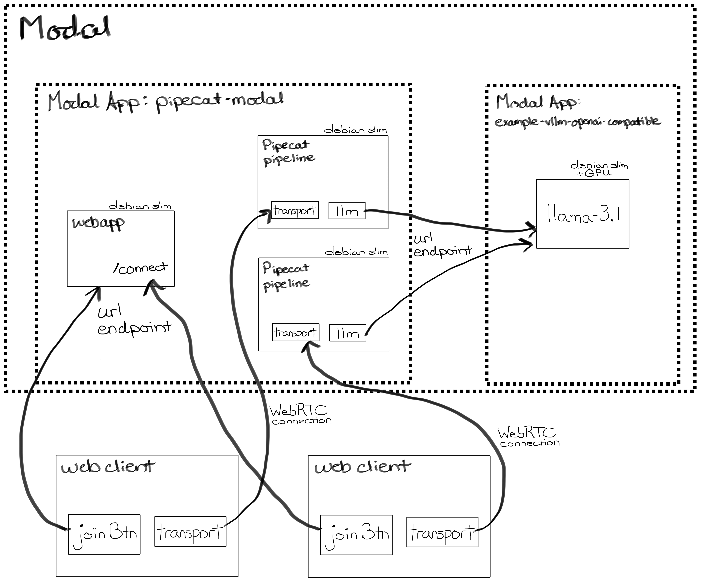

# Deploying Pipecat to Modal.com

Deployment example for [modal.com](https://www.modal.com). This example demonstrates how to deploy a FastAPI webapp to Modal with an RTVI compatible `/connect` endpoint that launches a Pipecat pipeline in a separate Modal container and returns a room/token for the client to join. This example also supports providing a parameter to the `/connect` endpoint for specifying which Pipecat pipeline to launch; openai, gemini, or vllm. The vllm pipeline points to a self-hosted OpenAI compatible LLM, using a llama model (neuralmagic/Meta-Llama-3.1-8B-Instruct-quantized.w4a16), deployed to Modal.

# Running this Example

## Prerequisites

Setup a Modal account and install it on your machine if you have not already, following their easy 3-steps in their [Getting Started Guide](https://modal.com/docs/guide#getting-started)

## Deploy a self-serve LLM

Follow the Modal Guide and example for [Deploying an OpenAI-compatible LLM service with vLLM](https://modal.com/docs/examples/vllm_inference).

The TLDR, though, is to simply do the following from within this directory:

```bash
git clone https://github.com/modal-labs/modal-examples
cd modal-examples
modal deploy 06_gpu_and_ml/llm-serving/vllm_inference.py
```

## Deploy FastAPI App and Pipecat pipeline to Modal 

1. Setup environment variables

```bash
cd server
cp env.example .env
# Modify .env to provide your service API Keys
```

Alternatively, you can configure your Modal app to use [secrets](https://modal.com/docs/guide/secrets)

2. Update the `modal_url` in `server/src/bot_vllm.py` to point to the url produced from the self-serve llm deploy. It should have looked something like: `https://<Modal workspace>--example-vllm-openai-compatible-serve.modal.run`

3. From within the `server` directory, test the app locally:

```bash
modal serve app.py
```

4. Deploy to production

```bash
modal deploy app.py
```

## Launch and Talk to your Bots running on Modal

## Option 1: Direct Link

Simply click on the url displayed after running the server or deploy step to launch an agent and be redirected to a Daily room to talk with the launched bot. This will use the OpenAI pipeline.

## Option 2: Connect via an RTVI Client

Follow the instructions provided in the [client folder's README](client/javascript/README.md) for building and running a custom client that connects to your Modal endpoint. The provided client provides a dropdown for choosing which bot pipeline to run.

# Navigating your llm, server, and Pipecat logs

In your [Modal dashboard](https://modal.com/apps), you should have two Apps listed under Live Apps:

1. `example-vllm-openai-compatible`: This App contains the containers and logs used to run your self-hosted LLM. There will be just one App Function listed: `serve`. Click on this function to view logs for your LLM.
2. `pipecat-modal`: This App contains the containers and logs used to run your `connect` endpoints and Pipecat pipelines. It will list two App Functions:
    1. `fastapi_app`: This function is running the endpoints that your client will interact with and initiate starting a new pipeline (`/`, `/connect`, `/status`). Click on this function to see logs for each endpoint hit.
    2. `bot_runner`: This function handles launching and running a bot pipeline. Click on this function to get a list of all pipeline runs and access each run's logs.

## Diagram of Deployment



# Modal + Pipecat Tips

<!--
<FIX ME: fill in the following>

<Recommended image settings for webapp container>
<Recommended image settings for pipeline container>
<Recommendations for min_containers and fast bot joins>
<Link to Advanced example with Services self-hosted on Modal>
-->